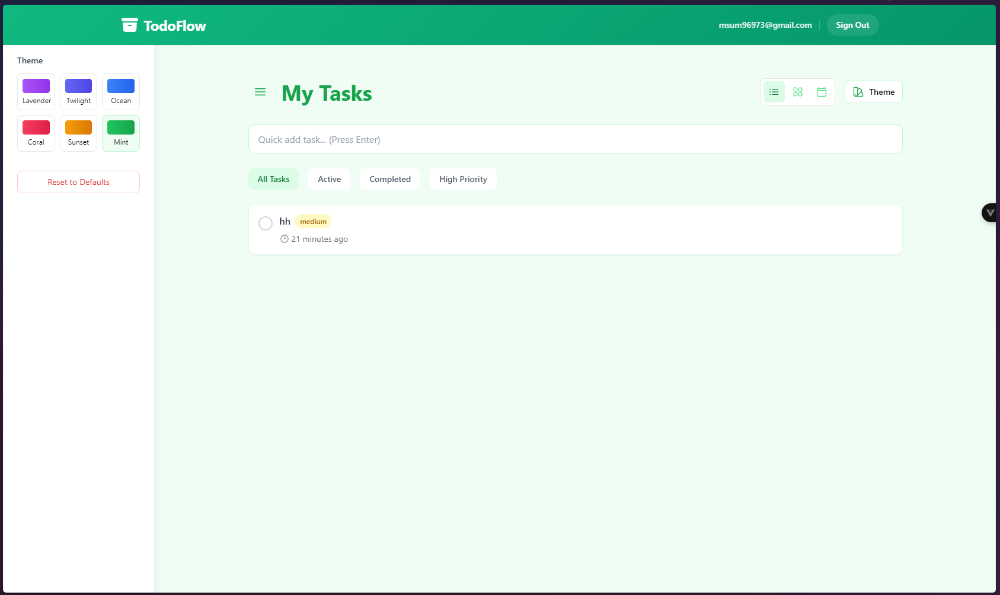

# TodoFlow

A modern, feature-rich task management application built with Vue 3, TypeScript, and Firebase.



## 🌟 Features

- **Real-time Task Management**
  - Create, update, and delete tasks instantly
  - Mark tasks as complete/incomplete
  - Set priority levels and due dates
  - Add detailed descriptions

- **Smart Organization**
  - Filter tasks by status (All, Active, Completed)
  - Priority-based task management
  - Quick add functionality
  - Grid and list view options

- **Modern UI/UX**
  - Clean, responsive design
  - Customizable themes
  - Smooth animations
  - Intuitive interface

- **Authentication & Security**
  - Secure user authentication
  - Protected routes
  - Data privacy

## 🚀 Tech Stack

- Vue 3 with Composition API
- TypeScript
- Tailwind CSS
- Firebase (Authentication & Firestore)
- Vite
- Pinia for state management

## 📦 Installation

1. Clone the repository:
```bash
git clone https://github.com/yourusername/todoflow.git
cd todoflow
```

2. Install dependencies:
```bash
npm install
```

3. Create a Firebase project and add your configuration:
   - Create a `.env` file in the root directory
   - Add your Firebase configuration:
```env
VITE_FIREBASE_API_KEY=your_api_key
VITE_FIREBASE_AUTH_DOMAIN=your_auth_domain
VITE_FIREBASE_PROJECT_ID=your_project_id
VITE_FIREBASE_STORAGE_BUCKET=your_storage_bucket
VITE_FIREBASE_MESSAGING_SENDER_ID=your_messaging_sender_id
VITE_FIREBASE_APP_ID=your_app_id
```

4. Start the development server:
```bash
npm run dev
```

## 🛠️ Development

- Run development server: `npm run dev`
- Build for production: `npm run build`
- Lint code: `npm run lint`
- Format code: `npm run format`

## 🔒 Firebase Security Rules

The application uses custom security rules to ensure data privacy. You can find the rules in:
```typescript
// firestore.rules
```

## 🎨 Theme Customization

TodoFlow supports multiple themes that can be customized through the UI. Available themes include:
- Green (Default)
- Blue
- Purple
- Indigo
- Rose
- Amber

## 🤝 Contributing

1. Fork the repository
2. Create your feature branch (`git checkout -b feature/AmazingFeature`)
3. Commit your changes (`git commit -m 'Add some AmazingFeature'`)
4. Push to the branch (`git push origin feature/AmazingFeature`)
5. Open a Pull Request

## 📝 License

This project is licensed under the MIT License - see the [LICENSE](LICENSE) file for details.

## 🙏 Acknowledgments

- Vue.js team for the amazing framework
- Firebase team for the backend infrastructure
- All contributors who help improve TodoFlow

---

Made with ❤️ by Abdullah Al Masum
